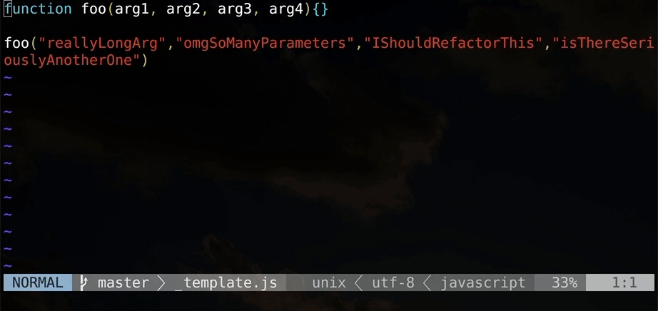

# vim-prettier

[](https://travis-ci.org/heavenshell/vim-prettier)

Prettier for Vim.



`vim-pritter` is a wrapper of Pritter.

Pritter official document recommends like followings.

```viml
autocmd FileType javascript set formatprg=prettier\ --stdin
```

`set formatprg` runs sync and it's too slow.

`vim-pritter` runs asynchronously and doesn't block editing.
